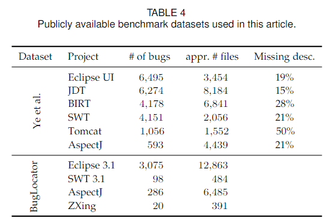

# SRTP项目仓库

## 基本信息

### 课题名称: 基于深度学习的源代码缺陷定位

### 小组成员

* 吴清晏 ⭐
* 杨锦波
* 张闻启
* 董子翔
* 万奕含

## 仓库结构

### tracking_buggy_files

克隆自[仓库](https://github.com/mfejzer/tracking_buggy_files)，包含两个十分常用的数据集`fine-grained`和`BugLocator`。

#### `fine-grained`数据集

包括6个项目，它们都使用`Bugzilla`作为问题追踪系统，使用Git作为版本管理系统。

被分为大小相等的训练集和测试集，每组包含500个错误报告。每个项目包含多组数据。

错误报告与修复代码通过查找类似`bug 31946`与`fix for 31946`的词进行对齐。

此外，部分错误报告缺少描述，针对这些文件进行了补全。(为复现该数据集提出者的论文，该仓库同时尝试了补全前和补全后的数据集)

#### BugLocator数据集

错误报告数量比`fine-grained`少，主要用于横向对比。

### CodeBERT

克隆自[仓库](https://github.com/microsoft/CodeBERT)，包含6种处理代码语言和自然语言的模型，其中`CodeBERT`，`GraphCodeBERT`和`UniXcoder`已经内置了代码搜索任务。

但是其余三个模型，`CodeReviewer`关注代码审查以及注释生成，`LongCoder`关注长代码处理，`CodeExecutor`基于`UniXcoder`开发，拓展了额外的功能，对我们的帮助不大。因此，仅保留前三个模型。

为控制仓库大小，未内置任何数据集，请自行按说明下载。
