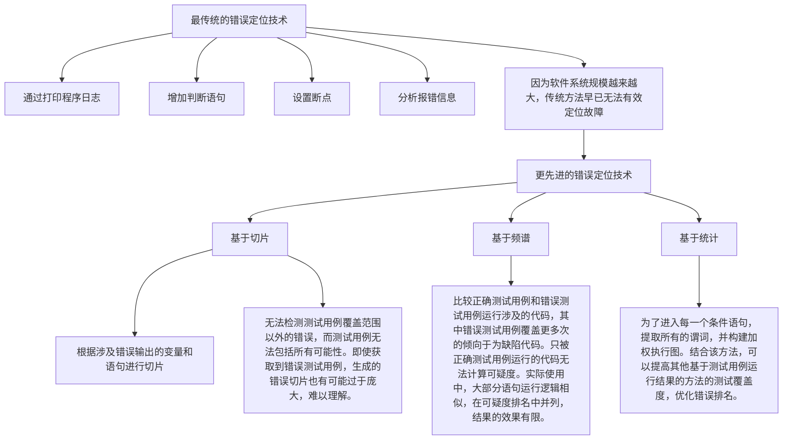

# 缺陷定位方法

## 最传统的错误定位技术

* 通过打印程序日志
* 增加判断语句
* 设置断点
* 分析报错信息

**因为软件系统规模越来越大，传统方法早已无法有效定位故障**

## 更先进的错误定位技术

### 基于切片

**简介**：根据涉及错误输出的变量和语句进行切片

无法检测测试用例覆盖范围以外的错误，而测试用例无法包括所有可能性。

即使获取到错误测试用例，生成的错误切片也有可能过于庞大，难以理解。

### 基于频谱

**简介**：比较正确测试用例和错误测试用例运行涉及的代码，其中错误测试用例覆盖更多次的倾向于为缺陷代码。

只被正确测试用例运行的代码无法计算可疑度。实际使用中，大部分语句运行逻辑相似，在可疑度排名中并列，结果的效果有限。

### 基于统计

**简介**：为了进入每一个条件语句，提取所有的谓词，并构建加权执行图。结合该方法，可以提高其他基于测试用例运行结果的方法的测试覆盖度，优化错误排名。

### 基于程序状态

### 基于机器学习

### 基于数据挖掘

### 基于模型

### 其他技术

