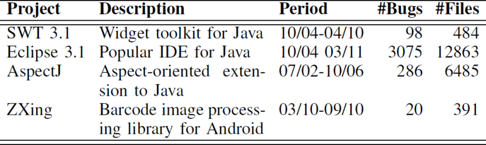

# 第三轮文献综述整理

本轮整理仅关注错误定位领域基于信息检索的技术，重点关注使用深度学习的方法
(如果方法使用深度学习，则只要是错误定位就收集)

除错误定位本领域论文以外，还关注深度学习领域有能力处理代码的模型及对应论文。

## 软件错误定位研究综述(2016)

这一篇对错误定位的分类比较全面，但是，将基于信息检索(IR)的方法归到了其他方法(P15右)它提到：

> 这些研究使用一个初始bug报告，根据源代码文件与bug报告的相关性，将源代码文件降序排列。然后，开发人员可以检查这个排名，并识别出包含bug的文件。与基于频谱的错误定位技术不同，基于信息检索的技术不需要程序覆盖信息，但它们生成的排名仅基于源代码文件，而不是基于语句、块或谓词等粒度更细的程序元素。  

此外，针对基于机器学习的方法，该综述提到了基于BP神经网络或基于决策树的算法，没有提到其他常见的神经网络算法如CNN，RNN，GNN，LSTM等和深度学习算法如Transformer等，考虑到论文完成的时间(2016)，机器学习当时才刚刚起步，所以这篇综述对其关注有限。

(这篇论文对综述作用有限)

## 进行函数级建模以完成文件级错误定位

论文提到，基于信息检索的方法过于简单，无法充分提取程序中的结构信息，而基于深度学习的方法(此处指深度神经网络)CNN无法处理长文本，而RNN如LSTM易出现梯度消失或爆发，收敛缓慢，且无法对元数据特征(如错误代码的时间远近和频率高低)进行建模。

所以，这篇论文提出了一种新框架(FLIM)，首先训练一个模型用于提取函数级交互特征，然后应用LTR(Learn to rank)模型计算最终的相似度得分。其中，训练模型采用了自然语言处理领域的预训练+微调模式，采用CodeBERT作为预训练模型并在缺陷定位任务上进行微调。

CodeBERT模型在CodeSearchNet数据集上进行了预训练，该数据集主要包括6种编程语言(包括java)的代码和英文文本注释的对照数据。CodeBERT在RoBERTa模型的基础上训练得来，RoBERTa模型本身有处理英文文本的能力，是自然语言处理领域分类任务中最强大的模型。

## 基于错误报告的更准确的信息检索 Bug 本地化

写于2013年，提出了Buglocator，是基于信息检索的错误定位方法中最著名的之一，后续的其他基于信息检索的方法大多将其视为基线模型进行比较。该项目在四个著名开源项目Eclipse、AspectJ、SWT 和 ZXing上进行了测试，并开放了数据集(这个数据集后续几乎成为了基准数据)。

值得注意的是，这四个开源项目都是基于Java语言的，所以这个数据集可以看作是一个Java语言的数据集。Eclipse 和 AspectJ 都使用 Bugzilla 错误跟踪系统和 CVS/SVN 版本控制系统，只需要调用Bugzilla的api就可以获取每一份错误报告。SWT属于Eclipse，是为了评估子项目级别的错误定位效果，而ZXing是一个Android项目，使用Google提供的错误跟踪系统。

采用的评估标准主要有3个：Top N，MRR，MAP。其中Top N是错误定位领域常见的评估方法，而MAP和MRR是信息检索领域的常见指标。

在深度学习领域，模型需要大量的训练数据，这个数据集的ZXing只包含20个Bug，即使用于评估效果也很有限，最大的模型Eclipse与

## 使用结构化信息检索改进 bug 本地化

写于2013年，提出了BLUiR，同样基于信息检索，但是充分利用了代码结构信息，如“类名”和“函数名”等，它采用了与Buglocator相同的数据集。事实上，之后的每个IR-based定位模型都会提到Buglocator并宣称在4个开源项目的表现上超越了Buglocator。

与Buglocator相比，该方法引入了AST(抽象语法树)，以保存更多的结构信息，同时丢弃了类似if、else的语言标识符，让模型能在更关注变量间关联的同时保留代码结构信息。

