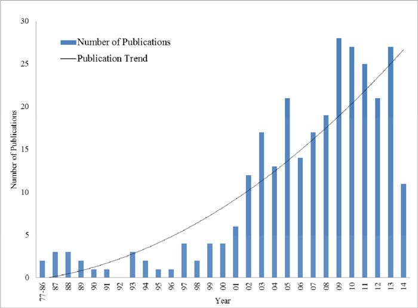
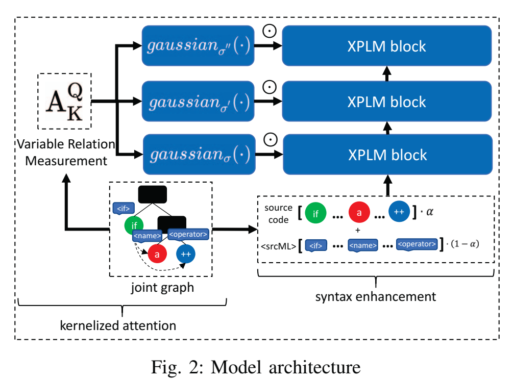
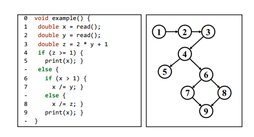

# 参考文献整合

## 软件错误定位研究综述(2016)

整理了从1977年到2014年11月发表的331篇论文，数量逐年上升

分为5类：静态切片，基于频谱，基于统计，基于状态，基于机器学习。其中对基于机器学习的定位方法部分

## 软件错误定位研究综述(印度)(2023)

分为5类，异常行为，实验(突变)，依赖性分析，逻辑推理，知识重用

其中，实验(突变)类似基于频谱(SBFL)和基于突变(MBFL)，依赖于实际运行代码。

逻辑推理指缩减测试用例到一个最小命中集，但即使不考虑测试用例覆盖率的问题，寻找最小命中集问题已被证明为np完全问题，不存在多项式时间算法，成本较高。

基于知识重用的方法关注错误提交历史，构建bug数据库，或利用以前编写的代码来总结隐式编程规则等。

基于依赖性分析的方法往往利用控制流图等，还包括静态切片和动态切片等。

基于异常行为的方法往往只能处理单一类别的问题，可扩展性差。

总体上，这篇综述提到了一些新颖的方法，但论文的覆盖量过少，没有看到特别有价值的信息。

## 通过同时使用Bug报告和测试来更好地自动修复程序(ACM_1)

提出了“SBIR”方法，结合了基于测试(频谱)和基于Bug报告(信息检索)的方法并在与自动修复任务相结合。其中，针对信息检索任务提出了“Blues”，一种IRFL技术，能通过Bug报告定位语句级别的缺陷，因为现有技术只能在函数级别进行定位，而自动修复需要语句级别。Blues在Defects4J  上进行训练，此前唯一的语句级方法是iFixR提出的方法，该方法采用的预训练模型在Bench4BL  项目(ACM_47)提供的数据集上训练，与Defects4J有重复。Blues方法基于BLUir技术(2013)，这是一种无监督的文件级IRFL技术。

## 面向程序分析的跨语言迁移学习框架(ACM_7)

利用srcML从输入代码的抽象语法树中提取元数据标签，并将源代码与元数据标签加权求和作为输入，进行数据增强，使模型在未见过的语言上表现更好。

## 结合基于值和谓词的因果推理技术改进错误定位(ACM_8)

提出了UniVal，原理是把分支和循环中的谓词提取为变量值，把原先基于覆盖率或谓词的方法与基于值的方法相结合，是一种更先进的统计错误定位(SFL)方法。

## 检测共变修复位置的错误定位(ACM_13)

在自动修复任务上取得很好表现的错误定位方法，创新点是可以为一个失败的测试用例同时定位多个错误并修正，以保证测试用例结果正常。

具体来说，它实现了函数级模型MethFL和语句级模型StmtFL，同时训练两个模型并共享参数(通过cross-stitch units  实现)。此外，针对“共变修复”代码之间的依赖关系，训练了图神经网络模型来找出存在潜在依赖关系的代码。

ACM_17的主题与这一片类似，同样关注跨越多行错误代码的定位。

ACM_19同样关注多故障定位问题，它的解决方案是精简测试集

## 基于数据流的进化错误定位 (ACM_14) 

类似基于覆盖率的方法，这篇论文采用“基于搜索”的错误定位方法，该方法将启发式搜索，遗传算法等技术与频谱覆盖矩阵结合起来，将错误定位问题看作优化问题。这篇文章额外尝试了不同分数来源的可以读分数组合，包括控制流，数据流和两者混合，结论是基于数据流有效性更高，但无法打破平局，需要额外的平局打破策略，而混合方法对可疑度分数平局有更好的处理能力。

## 一种通用的错误定位数据增强方法(ACM_15)

提出了一种名为Aeneas的数据增强方法，可以从有限的特征空间合成失败测试用例。

在现实项目中，失败测试用例占总测试用例的比重小于3%，这可能会降低SFL和DLFL的效率。本方法参考了机器学习领域的数据增强思想，类似过采样方法。

此外，错误代码占总代码的比重同样较小，这也是一种不平衡，导致了特征空间的维度很高，只有相对较少的可区分特征，这不利于机器学习。

针对这些问题，本方法首先简化原始覆盖矩阵(降维)，再从简化后的特征空间生成失败测试用例，以解决维度过高和数据集不平衡问题。

##  面向文件级缺陷定位的函数级交互建模(旧数据)

(重要，目前正在复现这一篇论文)

关键词：基于信息检索(IR-based)，深度学习，函数级

采用了CodeBERT预训练模型，把错误定位任务视为为代码搜索任务

## 基于图神经网络的两相错误定位方法(ACM_16) 

这里的两相指两阶段，即先定位到方法，再定位语句。传统的SFBL可能只能定位到包含故障的块(而不是具体语句)或因为覆盖率问题，略过整个块，而基于突变的方法(MBFL)开销太大。

这里引入图神经网络来处理数据流图和控制流图，来在同一基本块内进一步提高定位精度。具体来说，将语句作为图中的节点，将控制流关系和数据依赖关系作为边。

## 数据流系统中因果错误的定位(ACM_18)

这篇论文研究了一种基于因果推理的故障定位，运用因果归因机制在各种数据流框架，应用领域和故障模式上进行研究。该因果归因机制在2023年的一篇论文中提出，那篇论文在部分场景下证明了数据流图是完全因果图，输入数据如果符合独立同分布，那么每个节点的数据同样符合一定的关系，其中发生偏移的节点更大概率出现故障。但是，总体上，因果推理方法还不成熟，其有效性需要进一步的证明。

## BugPecker:基于修正图的深度学习定位错误方法(ACM_20)

(与序号9同类型！)

基于信息检索(IR)的错误定位，与原先IR-based方法最大区别是引入了深度学习，提出了BugPecker。

分为三部分：

1. 首先根据修复历史构建修订图，使用Spoon提取函数间调用关系，使用另一个方法提取代码提交与错误报告之间的修复关系(*该功能目前寻找到的数据集已提供*)

2. 然后通过抽象语法树来学习代码特征

   (论文提到本文是第一篇将抽象语法树引入基于信息检索的错误定位的论文，这篇论文发表于2020年，确实早于目前看到的其他包含AST的IR-based方法)

   在训练学习模型时，采用了Word2Vec进行词嵌入

   (Word2Vec提出于2013，现在大火的GPT模型基于Transformer，词嵌入采用的位置编码方式与Word2Vec不同，考虑到现在大语言模型LLM的潜力，Word2Vec似乎已经过时)

   并采用多层感知机将错误报告与函数嵌入映射为相同维度的向量，并通过余弦距离计算语义相似度。(这似乎与UniXcoder方法类似)。此外，由于数据集中大部分方法较短，对于每一个方法，把SimRank前十的方法和其调用的所有方法组成联合方法用于扩展。
   
3. 最后，输入错误报告，让模型从方法集合中选择最可能的错误方法

